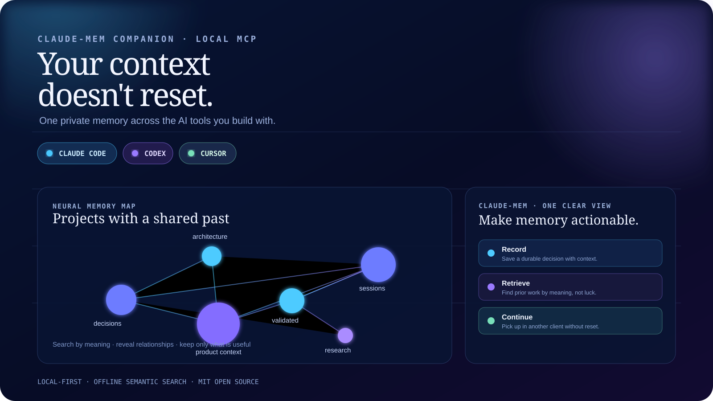
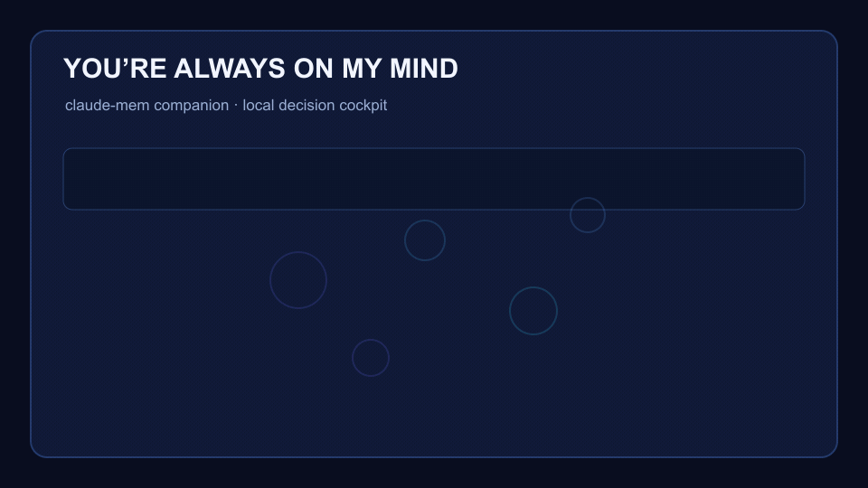
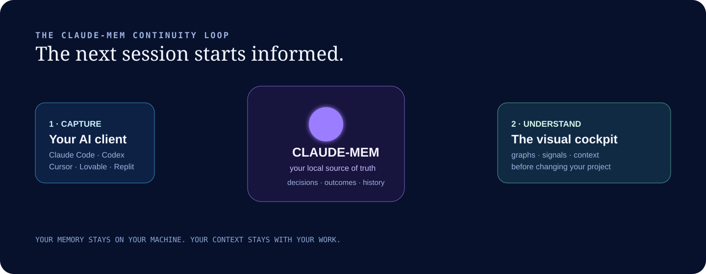
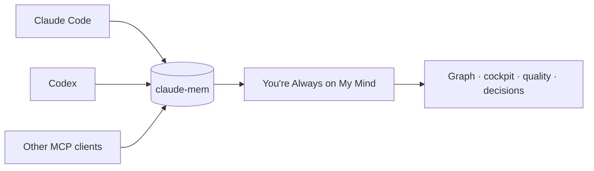

<div align="center">

# You're Always on My Mind

### The visual memory cockpit for claude-mem.

**claude-mem remembers. You see the whole picture.**

[](LICENSE)
[](#privacy)
[](#connect-your-tools)

`claude-mem` · `Claude Code` · `Codex` · `Cursor` · `Lovable` · `Replit` · `Antigravity`

</div>

claude-mem already captures durable decisions, discoveries and outcomes. Once
you have enough projects and sessions, the hard question changes:

> What is connected? What is stale? What matters now? What should the next agent know before it changes anything?

**You're Always on My Mind** is the complementary cockpit for answering that.
It reads and organizes the local memory claude-mem preserves, turns it into an
interactive graph, connects related projects, surfaces quality signals, and
gives you a decision layer for accumulated context.

> Think of it as the Omega-3 companion for claude-mem: it does not replace the memory. It makes the memory healthier, clearer and more useful.



## See it work





## claude-mem captures. You navigate.



## What it gives you

- Persistent project memory across sessions and MCP-compatible AI clients.
- A visual intelligence companion for claude-mem — never a replacement for it.
- Offline semantic search, local embeddings, project relationships and clusters.
- A 3D local dashboard for saturation, quality, timelines and safe cleanup.
- Explainable feedback: useful, incorrect and obsolete memories can be ranked
  or hidden without silently deleting history.
- A pluggable local storage bridge, so you choose your database, folders,
  repositories and project taxonomy.
- Ready local importers for Claude Code and Codex session files, plus a generic
  JSONL interchange format for other tools.

## Privacy

Your database, embeddings, project context and credentials stay local by
default. The core workflow uses no paid model API. The dashboard binds to
`127.0.0.1`; exposing it remotely is an advanced deployment decision that you
must secure yourself.

## Get started

Requires Node.js 22+ and `sqlite3` for the compatible SQLite bridge.

This is a **claude-mem companion**: to use the dashboard and MCP server, you
also need a local claude-mem-compatible bridge. If it is not at the default
path, set `YOURE_ALWAYS_ON_MY_MIND_BRIDGE_PATH` before `npm run doctor`.

```bash
git clone https://github.com/luisroquette/youre-always_on_my_mind.git
cd youre-always_on_my_mind
npm install
npm run doctor
npm test
npm run dashboard
```

Open `http://127.0.0.1:4317`.

The first run expects a compatible local memory bridge. The default keeps
compatibility with the Claude-memory bridge used in this project. To use your
own source, point the gateway at your adapter:

```bash
export YOURE_ALWAYS_ON_MY_MIND_BRIDGE_PATH="/absolute/path/to/your/bridge"
export YOURE_ALWAYS_ON_MY_MIND_DATA_DIR="$HOME/.always-on-my-mind"
```

Start with [examples/always-on-my-mind.env.example](examples/always-on-my-mind.env.example)
and read the [adapter contract](docs/ADAPTERS.md).

## Connect your tools

Add this local MCP server to Claude Code, Codex, or any client that supports a
standard-input/output MCP connection:

```json
{
  "mcpServers": {
    "youre-always-on-my-mind": {
      "command": "node",
      "args": ["/absolute/path/to/youre_always_on_my_mind/src/index.js"]
    }
  }
}
```

Cursor, Lovable, Replit, Antigravity and future tools can connect when they
offer the same MCP transport. Client setup changes quickly; this repository
will document tested integration paths rather than make unsupported promises.


## Make it yours

You control the memory source, the project naming, the client that records an
outcome, and the dashboard's local data paths. A storage adapter can connect a
SQLite database, Markdown vault, local export, or your own repository index.
The MCP interface stays the same.

Read [docs/ADAPTERS.md](docs/ADAPTERS.md) to build or configure one.

## Import existing sessions

Preview imports before writing anything. The importer reads only the paths you
name and redacts common secrets and personal identifiers before producing a
candidate:

```bash
npm run import:sessions -- --source claude-code --input ~/.claude/projects/<project>/<session>.jsonl
npm run import:sessions -- --source codex --input ~/.codex/sessions/<date>/<session>.jsonl
```

Append `--commit` only after reviewing the dry-run output. See
[docs/ADAPTERS.md](docs/ADAPTERS.md) for generic JSONL imports and client
compatibility boundaries.

## What this is not

This is not a hosted memory SaaS, a claude-mem replacement, a competing memory
database, or a claim that every coding tool captures context automatically. It
is the local decision cockpit that helps you understand, relate and optimize
what claude-mem preserves.

## Contributing

Adapters, client setup guides and accessibility improvements are especially
welcome. See [CONTRIBUTING.md](CONTRIBUTING.md) and [SECURITY.md](SECURITY.md).

## License

[MIT](LICENSE) © 2026 Luis Roquette
